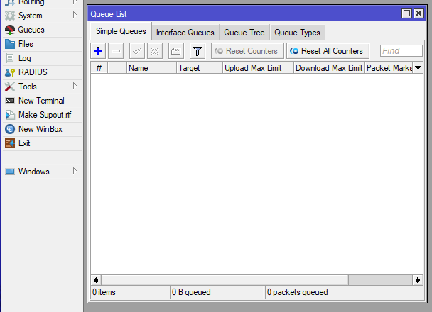
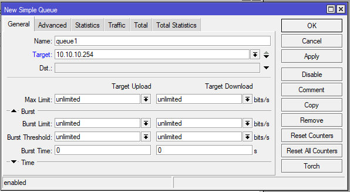
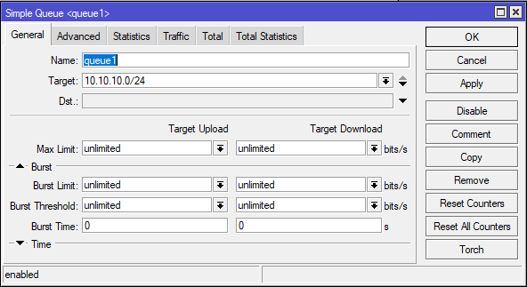
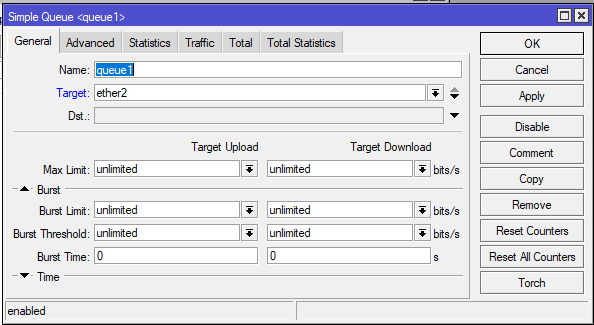
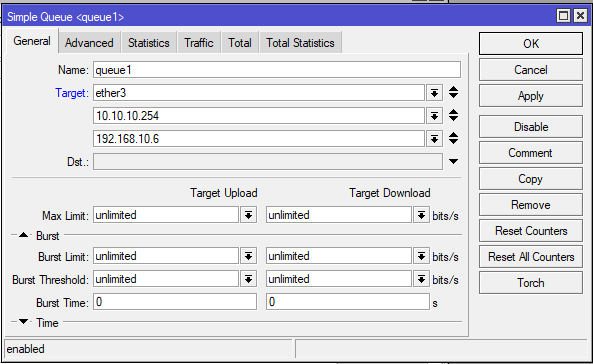
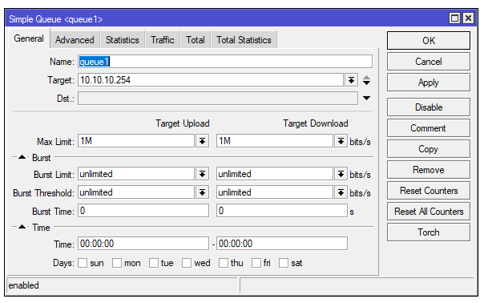
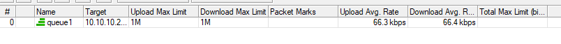
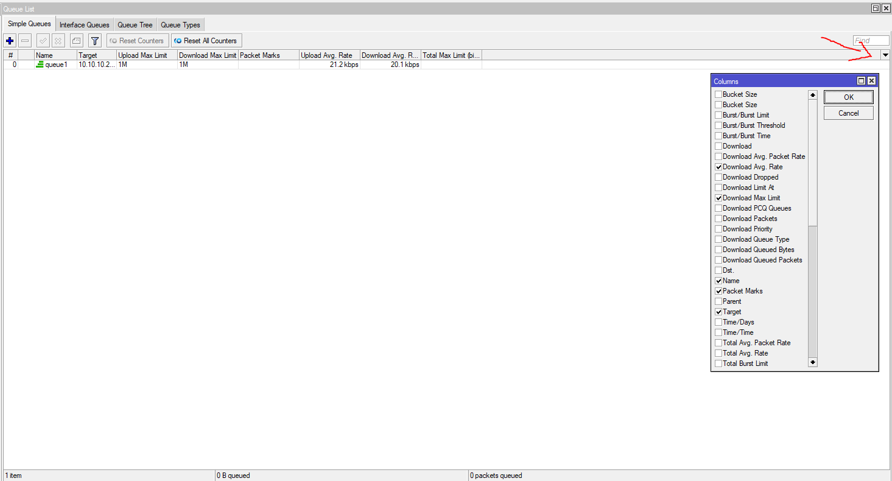
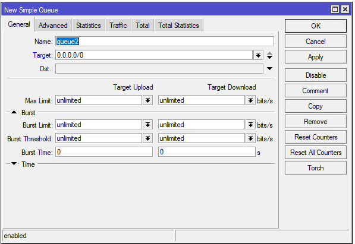
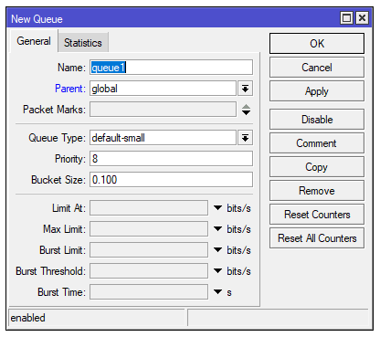

# LAB-27-Simple-Queue
Selasa 19 Agustus 2025  

# SIMPLE QUEUE
  Merupakan metode bandwidth management termudah yang ada di Mikrotik. Menu dan konfigurasi yang dilakukan untuk menerapkan simple queue cukup sederhana dan mudah dipahami.  
    
# Konfigurasi Simple queue
  1. Arahkan ke **QUEUE > SIMPLE QUEUE**  
    
  2. Lalu klik add (+).  
  3. Disini kita bisa melihat beberapa parameter, isi target dengan target yang akan di bandwidth. Cohtohnya disini saya akan mentargetkan Laptop saya.  
    
     Untuk **TARGET**, itu tidah hanya bisa diisi dengan **IP Address** saja, tapi bisa diisi dengan **subnet** yang digunakan untuk melimit suatu kelompok.  
     
     Dan juga selain itu kita bisa mengunakan **interface** dan nantinya rule akan mentargetkan interface tersebut, misalnya saat laptop terkoneksi ke ether2 atau switch agar terhubung ke banyak perangkat maka limitasi berlaku secara total.  
    
    Kita juga bisa melimit beberapa IP Address tanpa mengunakan subnet dengan mengunakan arah panah bawah **V** pada parameter **Target**.  
    
   4. Jika sudah menentukan targetnya, sekarang masukan limitnya dibagian **Target Upload & Download** pada bagian **Max Limit**  
     
      Jika sudah di apply, kita bisa melihat traffic di kolom **upload/download avg. rate**.  
    
      Jika tidak ada kolom **upload/download avg. rate**, kita bisa tambahkan di kanan tengah, di klik drop down menu dan pilih **show columns...** lalu cari dan checklist bagian **upload/download avg. rate**  
    
   6. Kita juga bisa mengatur kapan simple queue ini aktif, kita bisa lihat di paramater **time** dibagian tab **general**.  
    
   7. Kemudian klik **OK**, dan sekarang kita sudah mempunyai sebuah simple queue.  

# Pembahasan 
  **- Packet Marks**  
      Bisa digunakan untuk menggabungkan simple queue dengan firewall mangle, packet marks bisa digunakan untuk melimit TCP traffic tertentu.  
      
# Perbedaan Simple Queue dan Queue Tree  
**1. Simple Queue**   
- Simple Queue mampu melimit Upload, download secara terpisah atau Total(Upload+download) sekaligus dalam satu rule menggunakan tab Total.  
- Setiap rule pada Simple Queue dapat berdiri sendiri ataupun dapat juga disusun dalam sebuah hierarki dengan mengarahkan Parent ke rule lain.  
- cukup sederhana dan mudah dipahami.  
    
  
**2. Queue Tree**  
- Pendefinisian target yang akan dilimit pada Queue Tree tidak dilakukan langsung saat penambahan rule Queue namun dilakukan dengan melakukan marking paket data menggunakan Firewall Mangle.    
- Setiap service pada jaringan dapat diberikan kecepatan yang berbeda.  
  

# Kesimpulan  
  Simple Queue pada Mikrotik merupakan metode bandwidth management paling sederhana yang mudah digunakan dan dipahami. Simple Queue cocok untuk manajemen bandwidth dasar dan cepat, sedangkan Queue Tree lebih tepat digunakan untuk kebutuhan kontrol lebih detail.  

# Sumber
Youtube - Citraweb - https://www.youtube.com/watch?v=NvlVRX4GOAc
Citraweb - https://citraweb.com/artikel/251/
